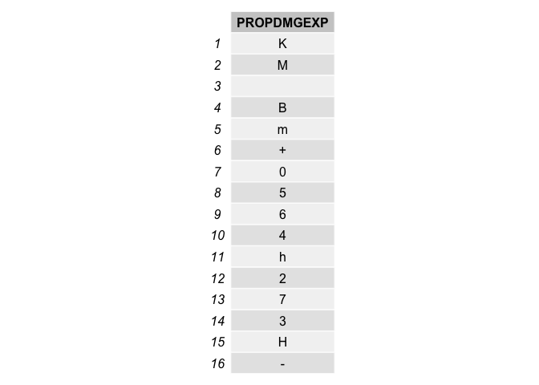
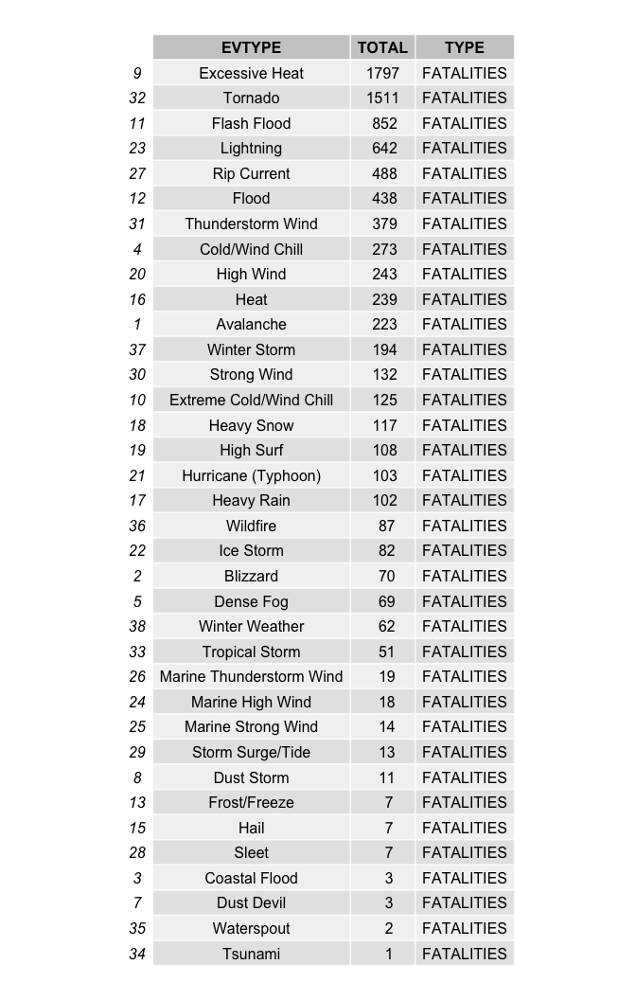
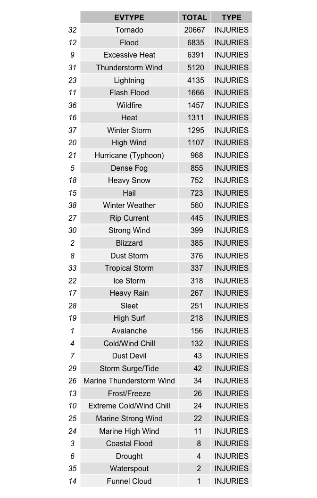
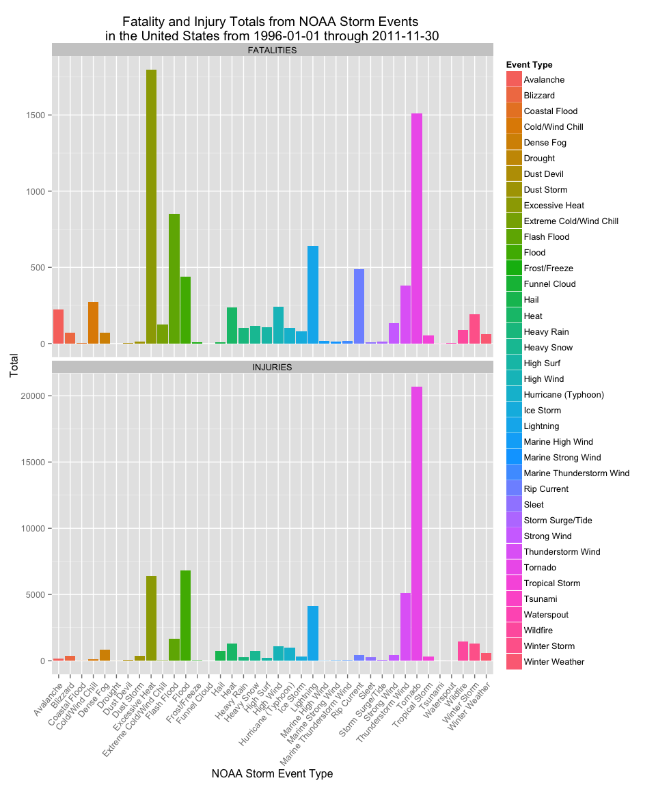
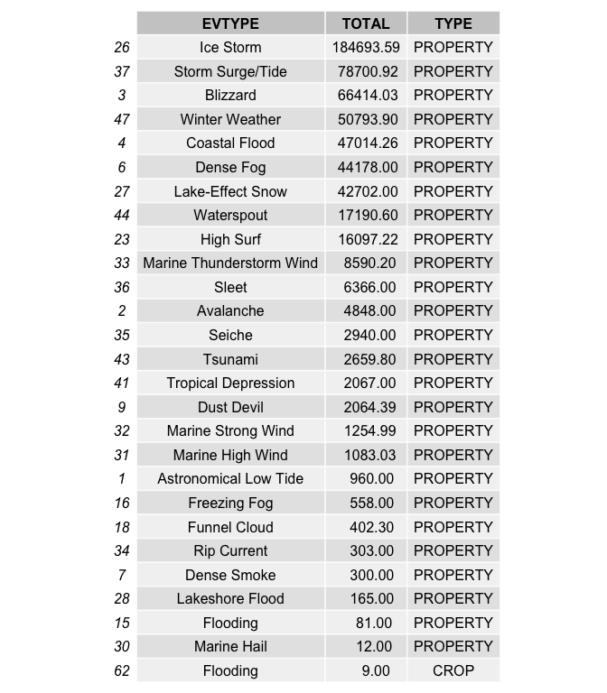
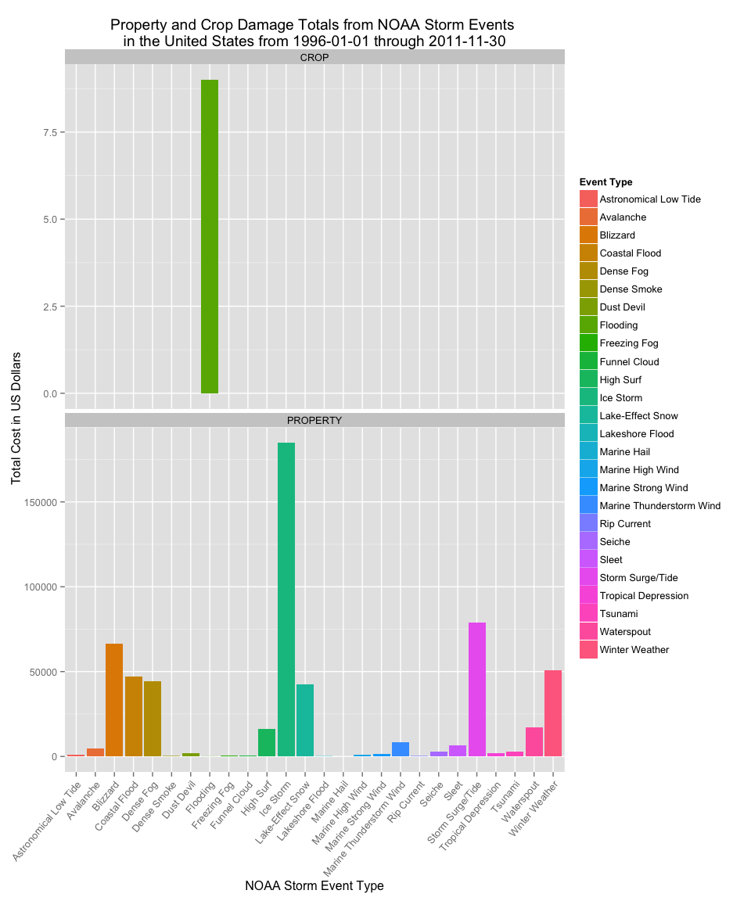

# Storm Data Analysis of US Storm Events - Which Event Types Are Most Harmful to US Population Health or Have Greatest US Economic Consequences
Carl M Smith  
`r Sys.Date()`  

## Synopsis

Storms and other severe weather events can cause both public health and economic problems for communities and municipalities. Many severe events can result in fatalities, injuries, and property damage, and preventing such outcomes to the extent possible is a key concern.

This project involves exploring the U.S. National Oceanic and Atmospheric Administration's (NOAA) storm database. This database tracks characteristics of major storms and weather events in the United States, including when and where they occur, as well as estimates of any fatalities, injuries, and property damage.

The events in the database start in the year 1950 and end in November 2011.

Consider writing your report as if it were to be read by a government or municipal manager who might be responsible for preparing for severe weather events and will need to prioritize resources for different types of events.

Between 1996 and 2011, excessive heat killed the most people in the US followed by tornados, flash floods and lightning.

Between 1996 and 2011, tornados caused the most injuries in the US followed by floods, excessive heat, wind and lightning.

Between 1996 and 2011, storm surge/tide caused the most property damage at 47.8 billion US dollars followed by ice storms at 3.6 billion US dollars and blizzards at 526 million US dollars.


## Data Processing


### Loading and preprocessing the data


The dataset used for this study, "repdata-data-StormData.csv.bz2", is available from "https://d396qusza40orc.cloudfront.net/repdata%2Fdata%2FStormData.csv.bz2".


```r
# load needed libraries
library(knitr)
library(plyr)
library(dplyr, warn.conflicts=FALSE)
library(grid)
library(ggplot2)
library(gridExtra) 
library(lubridate, warn.conflicts=FALSE)
library(stringr)


# Check to see if the repdata-data-StormData.csv file is around.
if(!file.exists("repdata-data-StormData.csv"))  {
        
        # Check if the "repdata-data-StormData.csv.bz2" file is around. If it is in the
        # current working directory, then just uncompress the file, if the uncompressed
        # file isn't around, download it.
        
        if(!file.exists("repdata-data-StormData.csv.bz2")) {
                fileURL <- "https://d396qusza40orc.cloudfront.net/repdata%2Fdata%2FStormData.csv.bz2"
                download.file(fileURL, destfile="repdata-data-StormData.csv.bz2", method="curl", mode="wb")
                dateDownloaded <- date()
                print(paste("Downloaded Storm data file on", dateDownloaded))
        }
}
```

  

```r
# read the repdata-data-StormData.csv.bz2 file into a variable.
stormdata <- read.csv(bzfile("repdata-data-StormData.csv.bz2"), stringsAsFactors = FALSE)
number_of_obs <- nrow(stormdata)
number_of_fields <- ncol(stormdata)
```

At this point stormdata contains 902297 observations with 37 fields.  
  
Because the focus of this research is to identify storm events that, "are harmful to US population health or have the greatest US economic consequences", any row that did not contain any fatalities or any injuries or any property damage or any crop damage was removed from the dataset.


```r
# remove all rows where there are no fatalies, no injuries, no property damage and no crop damage
stormdata <- stormdata[!(stormdata$FATALITIES == 0 & stormdata$INJURIES == 0 & stormdata$PROPDMG == 0 & stormdata$CROPDMG == 0),]
number_of_obs <- nrow(stormdata)
```

At this point stormdata contains 254633 observations with 37 fields.  
  
Fields that would not be used for this analysis were then removed.


```r
# Reorder the columns and only keep columns (aka, fields) used in this analysis
stormdata <- select(stormdata, REFNUM, STATE__, BGN_DATE, BGN_TIME, TIME_ZONE, COUNTY, COUNTYNAME, STATE, EVTYPE, FATALITIES, INJURIES, PROPDMG, PROPDMGEXP, CROPDMG, CROPDMGEXP, REMARKS)
number_of_fields <- ncol(stormdata)
```
  
At this point stormdata contains 254633 observations with 16 fields.  
  
Section 2.7, page 12 of the document "repdata-peer2_doc-pd01016005curr.pdf", available from "https://d396qusza40orc.cloudfront.net/repdata%2Fpeer2_doc%2Fpd01016005curr.pdf" explains how to enter
estimates for any property damage or crop damage and specifically how and what to enter into the PROPDMGEXP
and CROPDMGEXP column.  
  
> Estimates should be rounded to three significant digits, followed by an alphabetical
character signifying the magnitude of the number, i.e., 1.55B for $1,550,000,000. 
Alphabetical characters used to signify magnitude include “K” for thousands, “M” 
for millions, and “B” for billions.  
  
This information was used to generate property damage and crop damage in numerical form
where it could later be used to generate damage totals.  
  

```r
# get a list of distinct values in the PROPDMGEXP column
propdmgexp_distinct <- stormdata %>% select(PROPDMGEXP) %>% distinct

# get a list of distinct values in the CROPDMGEXP column
cropdmgexp_distinct <- stormdata %>% select(CROPDMGEXP) %>% distinct
```
  
The following values were found in the PROPDMGEXP fields:  
  
 
  
The following values were found in the CROPDMGEXP fields:  
  
 
  
Values of B, b, M, m, K, k, H and h were converted to their numerical magnitude and then used to convert the damages to their numerical representation. Other values were ignored because there doesn't seem to be any pattern that would significantly change the magnitude of the damage field. Specifically, the other values of 0,2,3,4,5,6 and 7 were ignored. One explaination for these values might be that they are the ones place of the damage value which was mistakenly shifted  over to the next column of the dataset. If this did happen, ignoring the shifted number should have no impact on the final results since this was only seen with numbers with no magnitude multiplier character and thus would be a very small value compared with the much larger values with magnitude mutipliers of H, K, M and B. It is unclear what the value of "+", "-", and "?" in the DMGEXP fields might have meant to the person who originally entered the values. 

One event's damage exponent magnitude was changed from "B" to "M" due to a high probability of a mistaken data entry. The event was a FLOOD in NAPA, CA on 2006-01-01. The remarks column for this event includes the following description:

> Major flooding continued into the early hours of January 1st, before the Napa River finally fell below flood stage and the water receeded. Flooding was severe in Downtown Napa from the Napa Creek and the City and Parks Department was hit with $6 million in damage alone. The City of Napa had 600 homes with moderate damage, 150 damaged businesses with costs of at least $70 million.

The remarks could easily add up to the property damage value entry which is 115 but the damage exponent clearly should be "M" rather than "B".  
  
Damage costs were not indexed to the consumer price index (CPI). This could be done in a future version of the analysis which would then mitigate any chance of a large storm event in a single year being under-weighted or over-weighted when compared with other events depending on if the large event happened nearer to 1996 or nearer to 2011.  
  

```r
# from repdata-peer2_doc-pd01016005curr.pdf available from 
# https://d396qusza40orc.cloudfront.net/repdata%2Fpeer2_doc%2Fpd01016005curr.pdf
# Section 2.7, page 12
# Estimates should be rounded to three significant digits, followed by an alphabetical character signifying 
# the magnitude of the number, i.e., 1.55B for $1,550,000,000. Alphabetical characters used to signify 
# magnitude include “K” for thousands, “M” for millions, and “B” for billions.
# lookup <- c(H=100, h=100, K=1000, k=1000, M=1000000, m=1000000, B=1000000000)
lookup <- c(H=2, h=2, K=3, k=3, M=6, m=6, B=9)

# Chnaging flood event in Napa on 2006-01-01 property damage multiplier from "B" to "M".
stormdata[stormdata$REFNUM == c(605943),13] <- c("M")

# use lookup to create a multiplier number then use that convert back to original numerical cost
the_prop_dmg_exp <- stormdata$PROPDMGEXP
stormdata$PROPDMGNUM <- as.integer(unname(lookup[the_prop_dmg_exp]))
stormdata$PROPDMGCOST <- as.double(stormdata$PROPDMG) * stormdata$PROPDMGNUM

# use lookup to create a multiplier number then use that convert back to original numerical cost
the_crop_dmg_exp <- stormdata$CROPDMGEXP
stormdata$CROPDMGNUM <- as.integer(unname(lookup[the_crop_dmg_exp]))
stormdata$CROPDMGCOST <- as.double(stormdata$CROPDMG) * stormdata$CROPDMGNUM

rm(lookup, the_prop_dmg_exp, the_crop_dmg_exp)

number_of_obs <- nrow(stormdata)
number_of_fields <- ncol(stormdata)
```
  
At this point stormdata contains 254633 observations with 20 fields.  
  
The STATE field contains the abbreviations for the 50 US states, 5 US protectorates, the District of Columbia and 11 of 12 NOAA marine coastal areas surrounding the US. 
  
Rows from US protectorites were removed since they clearly are not part of the US. Rows with the following STATE values were removed:
AS (American Samoa)
GU (Guam)
MH (Marshall Islands)
PR (Puerto Rico)
VI (Virgin Islands)
  
The 50 US states along with Washington D.C. and the NOAA marine coastal areas were kept. Damage to people and/or property in the Washington D.C. is damage to US population or property. Similar reasoning was used to keep the NOAA marine coastal areas. Damage to people and/or property in US marine coastal areas has a high chance of happening to boats or to people on boats that probably sailed from a local US marina.  
  

```r
# list of NOAA marine coastal areas from http://www.nws.noaa.gov/geodata/catalog/wsom/data/marst.txt
# remove rows with STATE = AS (American Samoa), GU (Guam), MH (Marshall Islands), PR (Puerto Rico), and 
# VI (Virgin Islands)

# Did NOT remove the following STATE values
# All but DC map to NOAA marine coastal areas and may contain damage
# DC (District of Columbia),
# AM (Marine Coastal Area - Western North Atlantic Ocean, and along U.S. East Coast, south of Currituck Beach Light,
#     N.C., following the coastline into Gulf of Mexico to Ocean Reef FL., including the Caribbean)
# AN (Marine Coastal Area - Western North Atlantic Ocean, and along U.S. East Coast, from Canadian border south 
#     to Currituck Beach Light, N.C.)
# GM (Marine Coastal Area - Gulf of Mexico, and along the U.S. Gulf Coast from the Mexican border to Ocean Reef FL.)
# LE (Marine Coastal Area - Lake Erie)
# LH (Marine Coastal Area - Lake Huron)
# LM (Marine Coastal Area - Lake Michigan)
# LO (Marine Coastal Area - Lake Ontario)
# LS (Marine Coastal Area - Lake Superior)
# PH (Marine Coastal Area - Central Pacific Ocean, including Hawaiian waters)
# PK (Marine Coastal Area - North Pacific Ocean near Alaska, and along Alaska coastaline, including the Bering Sea 
#     and the Gulf of Alaska)
# PZ (Marine Coastal Area - Eastern North Pacific Ocean, and along U.S. West Coast from Canadian border to 
#     Mexican border)
# SL (Marine Coastal Area - St. Lawrence River)

stormdata <- stormdata[(stormdata$STATE != 'AS' & 
                                stormdata$STATE != 'GU' & 
                                stormdata$STATE != 'MH' & 
                                stormdata$STATE != 'PR' & 
                                stormdata$STATE != 'VI'),]


number_of_obs <- nrow(stormdata)
number_of_fields <- ncol(stormdata)
```

At this point stormdata contains 253574 observations with 20 fields.  


http://www.ncdc.noaa.gov/stormevents/details.jsp explains that:

> from 1950 through 1954, only tornado events were recorded.

> From 1955 through 1992, only tornado, thunderstorm wind and hail events were keyed from paper publications into digital format and from 1993 to 1995,only tornado, thunderstorm wind and hail events have been extracted from the Unformatted Text Files.

> From 1996 to present, 48 event types are recorded as defined in NWS Directive 10-1605. 

Based on the above information, it was decided to use only the data from 1996 to present because only these years include all event types and therefore only these years can be equally compared. All rows before 1996 were removed.  
  


```r
# first create a column of only year and then use that to keep records from 1996 or newer
stormdata$parsed_date <- parse_date_time(stormdata$BGN_DATE, "m%d%Y H%M%S")
stormdata$year <- year(stormdata$parsed_date)
stormdata <- stormdata[stormdata$year >= 1996,]

number_of_obs <- nrow(stormdata)
number_of_fields <- ncol(stormdata)
```

At this point stormdata contains 200359 observations with 22 fields.  


```r
EVTYPE_count <- nrow(stormdata %>% select(EVTYPE) %>% distinct)
```


Section 2.1.1, page 6 Storm Data Event Table of the document repdata-peer2_doc-pd01016005curr.pdf which is available from https://d396qusza40orc.cloudfront.net/repdata%2Fpeer2_doc%2Fpd01016005curr.pdf lists the 48 permitted event types. At this point in the data cleaning process there are 216 different event types rather than the 48 permitted event types. 


```r
# reformat all Event Types into Title Case
stormdata$EVTYPE <- str_to_title(stormdata$EVTYPE, locale = "")

EVTYPE_count <- nrow(stormdata %>% select(EVTYPE) %>% distinct)
```

After normalizing the case for the EVTYPE field values, the count is down to 180 different event types.

Correct assignment of non-permitted events to permitted event types was accomplished by reading event details in each REMARKS column and following assignment criteria to reassign non-permitted event types to permitted event types.
  

```r
# Most of the EVTYPE == "Other"" events are Heavy Rain except for the following four events.
# I specifically modify these four events first so I can change the rest with a single,
# batch change.
stormdata[stormdata$REFNUM == c(296102),9] <- c("Dust Devil")
stormdata[stormdata$REFNUM == c(399102),9] <- c("Dust Devil")
stormdata[stormdata$REFNUM == c(435309),9] <- c("Dust Devil")
stormdata[stormdata$REFNUM == c(249429),9] <- c("Heavy Snow")

stormdata$EVTYPE <- str_replace(stormdata$EVTYPE, "^Astronomical High Tide$", "Coastal Flood")
stormdata$EVTYPE <- str_replace(stormdata$EVTYPE, "^Agricultural Freeze$", "Cold/Wind Chill")
stormdata$EVTYPE <- str_replace(stormdata$EVTYPE, "^Beach Erosion$", "High Surf")
stormdata$EVTYPE <- str_replace(stormdata$EVTYPE, "^Black Ice$", "Cold/Wind Chill")
stormdata$EVTYPE <- str_replace(stormdata$EVTYPE, "^Blowing Dust$", "Strong Wind")
stormdata$EVTYPE <- str_replace(stormdata$EVTYPE, "^Blowing Snow$", "Winter Storm")
stormdata$EVTYPE <- str_replace(stormdata$EVTYPE, "^Brush Fire$", "Wildfire")
stormdata$EVTYPE <- str_replace(stormdata$EVTYPE, "^Coastal Flooding$", "Coastal Flood")
stormdata$EVTYPE <- str_replace(stormdata$EVTYPE, "^Coastal Flooding/Erosion$", "Coastal Flood")
stormdata$EVTYPE <- str_replace(stormdata$EVTYPE, "^Coastal.*Erosion$", "Coastal Flood")
stormdata$EVTYPE <- str_replace(stormdata$EVTYPE, "^Coastalstorm$", "High Wind")
stormdata$EVTYPE <- str_replace(stormdata$EVTYPE, "^Coastal Storm$", "High Wind")
stormdata$EVTYPE <- str_replace(stormdata$EVTYPE, "^Cold$", "Cold/Wind Chill")
stormdata$EVTYPE <- str_replace(stormdata$EVTYPE, "^Cold And Snow$", "Cold/Wind Chill")
stormdata$EVTYPE <- str_replace(stormdata$EVTYPE, "^Cold Temperature$", "Cold/Wind Chill")
stormdata$EVTYPE <- str_replace(stormdata$EVTYPE, "^Cold Weather$", "Cold/Wind Chill")
stormdata$EVTYPE <- str_replace(stormdata$EVTYPE, "^Dam Break$", "Flash Flood")
stormdata$EVTYPE <- str_replace(stormdata$EVTYPE, "^Damaging Freeze$", "Frost/Freeze")
stormdata$EVTYPE <- str_replace(stormdata$EVTYPE, "^Downburst$", "Thunderstorm Wind")
stormdata$EVTYPE <- str_replace(stormdata$EVTYPE, "^Drowning$", "Flash Flood")
stormdata$EVTYPE <- str_replace(stormdata$EVTYPE, "^Dry Microburst$", "High Wind")
stormdata$EVTYPE <- str_replace(stormdata$EVTYPE, "^Early Frost$", "Frost/Freeze")
stormdata$EVTYPE <- str_replace(stormdata$EVTYPE, "^Erosion/Cstl Flood$", "Coastal Flood")
stormdata$EVTYPE <- str_replace(stormdata$EVTYPE, "^Excessive Snow$", "Heavy Snow")
stormdata$EVTYPE <- str_replace(stormdata$EVTYPE, "^Extended Cold$", "Cold/Wind Chill")
stormdata$EVTYPE <- str_replace(stormdata$EVTYPE, "^Extreme Cold$", "Cold/Wind Chill")
stormdata$EVTYPE <- str_replace(stormdata$EVTYPE, "^Extreme Windchill$", "Cold/Wind Chill")
stormdata$EVTYPE <- str_replace(stormdata$EVTYPE, "^ Flash Flood$", "Flash Flood")
stormdata$EVTYPE <- str_replace(stormdata$EVTYPE, "^Flash Flood/Flood$", "Flash Flood")
stormdata$EVTYPE <- str_replace(stormdata$EVTYPE, "^Flood/Flash/Flood$", "Flash Flood")
stormdata$EVTYPE <- str_replace(stormdata$EVTYPE, "^Fog$", "Dense Fog")
stormdata$EVTYPE <- str_replace(stormdata$EVTYPE, "^Falling Snow/Ice$", "Heavy Snow")
stormdata$EVTYPE <- str_replace(stormdata$EVTYPE, "^Freeze$", "Frost/Freeze")
stormdata$EVTYPE <- str_replace(stormdata$EVTYPE, "^Freezing Drizzle$", "Sleet")
stormdata$EVTYPE <- str_replace(stormdata$EVTYPE, "^Freezing Rain$", "Sleet")
stormdata$EVTYPE <- str_replace(stormdata$EVTYPE, "^Freezing Spray$", "Winter Storm")
stormdata$EVTYPE <- str_replace(stormdata$EVTYPE, "^Frost$", "Frost/Freeze")
stormdata$EVTYPE <- str_replace(stormdata$EVTYPE, "^Glaze$", "Sleet")
stormdata$EVTYPE <- str_replace(stormdata$EVTYPE, "^Gradient Wind$", "Strong Wind")
stormdata$EVTYPE <- str_replace(stormdata$EVTYPE, "^Gusty Wind$", "Strong Wind")
stormdata$EVTYPE <- str_replace(stormdata$EVTYPE, "^Gusty Winds$", "Strong Wind")
stormdata$EVTYPE <- str_replace(stormdata$EVTYPE, "^Gusty Wind/Hail$", "Hail")
stormdata$EVTYPE <- str_replace(stormdata$EVTYPE, "^Gusty Wind/Hvy Rain$", "Thunderstorm Wind")
stormdata$EVTYPE <- str_replace(stormdata$EVTYPE, "^Gusty Wind/Rain$", "Thunderstorm Wind")
stormdata$EVTYPE <- str_replace(stormdata$EVTYPE, "^Hard Freeze$", "Frost/Freeze")
stormdata$EVTYPE <- str_replace(stormdata$EVTYPE, "^Hazardous Surf$", "High Surf")
stormdata$EVTYPE <- str_replace(stormdata$EVTYPE, "^Heat Wave$", "Heat")
stormdata$EVTYPE <- str_replace(stormdata$EVTYPE, "^Heavy Rain/High Surf$", "Flooding")
stormdata$EVTYPE <- str_replace(stormdata$EVTYPE, "^Heavy Seas$", "Marine High Wind")
stormdata$EVTYPE <- str_replace(stormdata$EVTYPE, "^Heavy Snow Shower$", "Heavy Snow")
stormdata$EVTYPE <- str_replace(stormdata$EVTYPE, "^Heavy Surf$", "High Surf")
stormdata$EVTYPE <- str_replace(stormdata$EVTYPE, "^Heavy Surf And Wind$", "Marine High Wind")
stormdata$EVTYPE <- str_replace(stormdata$EVTYPE, "^Heavy Surf/High Surf$", "High Surf")
stormdata$EVTYPE <- str_replace(stormdata$EVTYPE, "^High Seas$", "Marine High Wind")
stormdata$EVTYPE <- str_replace(stormdata$EVTYPE, "^High Water$", "Flash Flood")
stormdata$EVTYPE <- str_replace(stormdata$EVTYPE, "^High Wind.*G40\\)$", "High Wind")
stormdata$EVTYPE <- str_replace(stormdata$EVTYPE, "^Hurricane$", "Hurricane (Typhoon)")
stormdata$EVTYPE <- str_replace(stormdata$EVTYPE, "^Hurricane Edouard$", "Hurricane (Typhoon)")
stormdata$EVTYPE <- str_replace(stormdata$EVTYPE, "^Hurricane/Typhoon$", "Hurricane (Typhoon)")
stormdata$EVTYPE <- str_replace(stormdata$EVTYPE, "^Hyperthermia/Exposure$", "Cold/Wind Chill")
stormdata$EVTYPE <- str_replace(stormdata$EVTYPE, "^Hypothermia/Exposure$", "Cold/Wind Chill")
stormdata$EVTYPE <- str_replace(stormdata$EVTYPE, "^Ice Jam Flood \\(Minor$", "Flash Flood")
stormdata$EVTYPE <- str_replace(stormdata$EVTYPE, "^Ice On Road$", "Frost/Freeze")
stormdata$EVTYPE <- str_replace(stormdata$EVTYPE, "^Ice Roads$", "Frost/Freeze")
stormdata$EVTYPE <- str_replace(stormdata$EVTYPE, "^Icy Roads$", "Frost/Freeze")
stormdata$EVTYPE <- str_replace(stormdata$EVTYPE, "^Lake Effect Snow$", "Lake-Effect Snow")
stormdata$EVTYPE <- str_replace(stormdata$EVTYPE, "^Landslide$", "Heavy Rain")
stormdata$EVTYPE <- str_replace(stormdata$EVTYPE, "^Landslump$", "High Surf")
stormdata$EVTYPE <- str_replace(stormdata$EVTYPE, "^Landspout$", "Dust Devil")
stormdata$EVTYPE <- str_replace(stormdata$EVTYPE, "^Late Season Snow$", "Heavy Snow")
stormdata$EVTYPE <- str_replace(stormdata$EVTYPE, "^Light Freezing Rain$", "Sleet")
stormdata$EVTYPE <- str_replace(stormdata$EVTYPE, "^Light Snow$", "Winter Storm")
stormdata$EVTYPE <- str_replace(stormdata$EVTYPE, "^Light Snowfall$", "Winter Storm")
stormdata$EVTYPE <- str_replace(stormdata$EVTYPE, "^Marine Accident$", "Marine High Wind")
stormdata$EVTYPE <- str_replace(stormdata$EVTYPE, "^Marine Tstm Wind$", "Marine Thunderstorm Wind")
stormdata$EVTYPE <- str_replace(stormdata$EVTYPE, "^Microburst$", "Thunderstorm Wind")
stormdata$EVTYPE <- str_replace(stormdata$EVTYPE, "^Mixed Precip$", "Sleet")
stormdata$EVTYPE <- str_replace(stormdata$EVTYPE, "^Mixed Precipitation$", "Sleet")
stormdata$EVTYPE <- str_replace(stormdata$EVTYPE, "^Mud Slide$", "Heavy Rain")
stormdata$EVTYPE <- str_replace(stormdata$EVTYPE, "^Mudslide$", "Heavy Rain")
stormdata$EVTYPE <- str_replace(stormdata$EVTYPE, "^Mudslides$", "Heavy Rain")
stormdata$EVTYPE <- str_replace(stormdata$EVTYPE, "^Non Tstm Wind$", "Thunderstorm Wind")
stormdata$EVTYPE <- str_replace(stormdata$EVTYPE, "^Non-Severe Wind Damage$", "Strong Wind")
stormdata$EVTYPE <- str_replace(stormdata$EVTYPE, "^Non-Tstm Wind$", "Thunderstorm Wind")
stormdata$EVTYPE <- str_replace(stormdata$EVTYPE, "^Other$", "Heavy Rain")
stormdata$EVTYPE <- str_replace(stormdata$EVTYPE, "^Rain$", "Heavy Rain")
stormdata$EVTYPE <- str_replace(stormdata$EVTYPE, "^Rain/Snow$", "Heavy Snow")
stormdata$EVTYPE <- str_replace(stormdata$EVTYPE, "^Record Heat$", "Heat")
stormdata$EVTYPE <- str_replace(stormdata$EVTYPE, "^Rock Slide$", "Heavy Rain")
stormdata$EVTYPE <- str_replace(stormdata$EVTYPE, "^Rogue Wave$", "High Surf")
stormdata$EVTYPE <- str_replace(stormdata$EVTYPE, "^Rough Seas$", "Marine High Wind")
stormdata$EVTYPE <- str_replace(stormdata$EVTYPE, "^Rough Surf$", "Marine High Wind")
stormdata$EVTYPE <- str_replace(stormdata$EVTYPE, "^Small Hail$", "Hail")
stormdata$EVTYPE <- str_replace(stormdata$EVTYPE, "^Snow$", "Heavy Snow")
stormdata$EVTYPE <- str_replace(stormdata$EVTYPE, "^Snow And Ice$", "Frost/Freeze")
stormdata$EVTYPE <- str_replace(stormdata$EVTYPE, "^Snow Squall$", "Heavy Snow")
stormdata$EVTYPE <- str_replace(stormdata$EVTYPE, "^Snow Squalls$", "Heavy Snow")
stormdata$EVTYPE <- str_replace(stormdata$EVTYPE, "^Storm Surge$", "Storm Surge/Tide")
stormdata$EVTYPE <- str_replace(stormdata$EVTYPE, "^Strong Winds$", "Strong Wind")
stormdata$EVTYPE <- str_replace(stormdata$EVTYPE, "^Thunderstorm Wind \\(G40\\)$", "Thunderstorm Wind")
stormdata$EVTYPE <- str_replace(stormdata$EVTYPE, "^Tidal Flooding$", "Coastal Flood")
stormdata$EVTYPE <- str_replace(stormdata$EVTYPE, "^Torrential Rainfall$", "Heavy Rain")
stormdata$EVTYPE <- str_replace(stormdata$EVTYPE, "^Unseasonable Cold$", "Cold/Wind Chill")
stormdata$EVTYPE <- str_replace(stormdata$EVTYPE, "^Unseasonably Cold$", "Cold/Wind Chill")
stormdata$EVTYPE <- str_replace(stormdata$EVTYPE, "^Unseasonably Warm$", "Heat")
stormdata$EVTYPE <- str_replace(stormdata$EVTYPE, "^Unseasonal Rain$", "Heavy Rain")
stormdata$EVTYPE <- str_replace(stormdata$EVTYPE, "^Urban/Sml Stream Fld$", "Flood")
stormdata$EVTYPE <- str_replace(stormdata$EVTYPE, "^Warm Weather$", "Heat")
stormdata$EVTYPE <- str_replace(stormdata$EVTYPE, "^Wet Microburst$", "Strong Wind")
stormdata$EVTYPE <- str_replace(stormdata$EVTYPE, "^Whirlwind$", "Dust Devil")
stormdata$EVTYPE <- str_replace(stormdata$EVTYPE, "^Wild/Forest Fire$", "Wildfire")
stormdata$EVTYPE <- str_replace(stormdata$EVTYPE, "^Wind$", "Strong Wind")
stormdata$EVTYPE <- str_replace(stormdata$EVTYPE, "^Wind And Wave$", "Marine High Wind")
stormdata$EVTYPE <- str_replace(stormdata$EVTYPE, "^Wind Damage$", "High Wind")
stormdata$EVTYPE <- str_replace(stormdata$EVTYPE, "^Winds$", "High Wind")
stormdata$EVTYPE <- str_replace(stormdata$EVTYPE, "^Rip Currents$", "Rip Current")
stormdata$EVTYPE <- str_replace(stormdata$EVTYPE, "^River Flood$", "Flood")
stormdata$EVTYPE <- str_replace(stormdata$EVTYPE, "^River Flooding$", "Flood")
stormdata$EVTYPE <- str_replace(stormdata$EVTYPE, "^Tstm$", "Thunderstorm Wind")
stormdata$EVTYPE <- str_replace(stormdata$EVTYPE, "^ Tstm Wind.*$", "Thunderstorm Wind")
stormdata$EVTYPE <- str_replace(stormdata$EVTYPE, "^Tstm Wind$", "Thunderstorm Wind")
stormdata$EVTYPE <- str_replace(stormdata$EVTYPE, "^Tstm Wind.*$", "Thunderstorm Wind")
stormdata$EVTYPE <- str_replace(stormdata$EVTYPE, "^Tstm Wind/Hail$", "Thunderstorm Wind")
stormdata$EVTYPE <- str_replace(stormdata$EVTYPE, "^Tstm Strong Wind$", "Thunderstorm Wind")
stormdata$EVTYPE <- str_replace(stormdata$EVTYPE, "^Thunderstorm$", "Thunderstorm Wind")
stormdata$EVTYPE <- str_replace(stormdata$EVTYPE, "^Thunderstorm Winds$", "Thunderstorm Wind")
stormdata$EVTYPE <- str_replace(stormdata$EVTYPE, "^Volcanic Ash Plume$", "Volcanic Ash")
stormdata$EVTYPE <- str_replace(stormdata$EVTYPE, "^Volcanic Ashfall$", "Volcanic Ash")
stormdata$EVTYPE <- str_replace(stormdata$EVTYPE, "^Wint?ry Mix$", "Winter Weather")
stormdata$EVTYPE <- str_replace(stormdata$EVTYPE, "^Winter Weather/Mix$", "Winter Weather")
stormdata$EVTYPE <- str_replace(stormdata$EVTYPE, "^Winter Weather Mix$", "Winter Weather")
stormdata$EVTYPE <- str_replace(stormdata$EVTYPE, "^Wnd$", "Strong Wind")

EVTYPE_count <- nrow(stormdata %>% select(EVTYPE) %>% distinct);

number_of_obs <- nrow(stormdata)
number_of_fields <- ncol(stormdata)
```

The final count of EVTYPE values is 47. At this point stormdata contains 200359 observations with 22 fields.  


```r
event_types <- stormdata %>% select(EVTYPE) %>% distinct
all_states <- stormdata %>% select(STATE) %>% distinct

# pull out rows that have no fatalities and no injuries to use for personal harm analysis
storm_injury_fatal <- stormdata[stormdata$FATALITIES != 0 | stormdata$INJURIES != 0,]

ef5 <- ddply(storm_injury_fatal, "EVTYPE", summarise, FATALITIES = sum(FATALITIES))
ef5$TYPE <- c("FATALITIES")
ef5 <- rename(ef5, EVTYPE=EVTYPE, TOTAL=FATALITIES, TYPE=TYPE)

# remove any row that has an NA in the total or a 0 in the total column
fatalities_summed <- ef5[!is.na(ef5$TOTAL) & ef5$TOTAL != 0,  ]
# order rows by total, largest to smallest
fatalities_summed <- fatalities_summed[order(fatalities_summed$TOTAL, decreasing=TRUE), ]

ei5 <- ddply(storm_injury_fatal, "EVTYPE", summarise, INJURIES = sum(INJURIES))
ei5$TYPE <- c("INJURIES")
ei5 <- rename(ei5, EVTYPE=EVTYPE, TOTAL=INJURIES, TYPE=TYPE)

# remove any row that has an NA in the total or a 0 in the total column
injuries_summed <- ei5[!is.na(ei5$TOTAL) & ei5$TOTAL != 0,  ]
# order rows by total, largest to smallest
injuries_summed <- injuries_summed[order(injuries_summed$TOTAL, decreasing=TRUE), ]

# put fatality totals and injury totals back together
eif5 <- rbind(ef5, ei5)


g6 <- ggplot(eif5, aes(x = EVTYPE, y = TOTAL, fill=EVTYPE)) + 
        geom_bar(stat = "identity") +
        facet_wrap(~ TYPE, scales = "free_y", ncol = 1)  +
        theme(axis.text.x=element_text(angle=50, vjust=1.0, hjust=1.0)) +
        xlab("NOAA Storm Event Type") +
        ylab("Total") +
        labs(fill = "Event Type") +
        ggtitle("Fatality and Injury Totals from NOAA Storm Events \nin the United States from 1996-01-01 through 2011-11-30")
```


```r
# pull out rows that have no property damage and no crop damage to use for economic impact analysis
storm_prop_crop <- stormdata[stormdata$PROPDMG != 0 | stormdata$CROPDMG != 0,]

total_prop_dmg <- sum(storm_prop_crop$PROPDMGCOST, na.rm=TRUE)
total_crop_dmg <- sum(storm_prop_crop$CROPDMGCOST, na.rm=TRUE)

# sum each type to get total cost by type
# then order by total cost
# plot the results

pd <- ddply(storm_prop_crop, "EVTYPE", summarise, PROPDMGCOST = sum(PROPDMGCOST))
pd$TYPE <- c("PROPERTY")
pd <- rename(pd, EVTYPE=EVTYPE, TOTAL=PROPDMGCOST, TYPE=TYPE)

cd <- ddply(storm_prop_crop, "EVTYPE", summarise, CROPDMGCOST = sum(CROPDMGCOST))
cd$TYPE <- c("CROP")
cd <- rename(cd, EVTYPE=EVTYPE, TOTAL=CROPDMGCOST, TYPE=TYPE)

# put property damage totals and crop damage totals back together
pcd <- rbind(pd, cd)

# remove any row that has an NA in the total or a 0 in the total column
pcd <- pcd[!is.na(pcd$TOTAL) & pcd$TOTAL != 0,  ]
# order rows by total, largest to smallest
ordered_pcd <- pcd[order(pcd$TOTAL, decreasing=TRUE), ]


g7 <- ggplot(pcd, aes(x = EVTYPE, y = TOTAL, fill=EVTYPE)) + 
        geom_bar(stat = "identity") +
        facet_wrap(~ TYPE, scales = "free_y", ncol = 1) +
        theme(axis.text.x=element_text(angle=50, vjust=1.0, hjust=1.0)) +
        xlab("NOAA Storm Event Type") +
        ylab("Total Cost in US Dollars") +
        labs(fill = "Event Type") +
        ggtitle("Property and Crop Damage Totals from NOAA Storm Events \nin the United States from 1996-01-01 through 2011-11-30")
```


##   Results

Between 1996 and 2011, excessive heat killed the most people in the US followed by tornados, flash floods and lightning.

Table of total fatalities caused by each event type.

 
  
Between 1996 and 2011, tornados caused the most injuries in the US followed by floods, excessive heat, wind and lightning.

Table of total injuries caused by each event type.

 

 
  
Between 1996 and 2011, storm surge/tide caused the most property damage at 47.8 billion US dollars followed by ice storms at 3.6 billion US dollars and blizzards at 526 million US dollars.

Crop damage costs are insignificant compared with property damage costs.
  
 

 

### System Details

```r
session_details <- sessionInfo()
session_details
```

```
## R version 3.2.0 (2015-04-16)
## Platform: x86_64-apple-darwin13.4.0 (64-bit)
## Running under: OS X 10.10.4 (Yosemite)
## 
## locale:
## [1] en_US.UTF-8/en_US.UTF-8/en_US.UTF-8/C/en_US.UTF-8/en_US.UTF-8
## 
## attached base packages:
## [1] grid      stats     graphics  grDevices utils     datasets  methods  
## [8] base     
## 
## other attached packages:
## [1] stringr_1.0.0   lubridate_1.3.3 gridExtra_2.0.0 ggplot2_1.0.1  
## [5] dplyr_0.4.2     plyr_1.8.3      knitr_1.10.5   
## 
## loaded via a namespace (and not attached):
##  [1] Rcpp_0.12.0      magrittr_1.5     MASS_7.3-40      munsell_0.4.2   
##  [5] colorspace_1.2-6 R6_2.1.0         tools_3.2.0      parallel_3.2.0  
##  [9] gtable_0.1.2     DBI_0.3.1        htmltools_0.2.6  lazyeval_0.1.10 
## [13] yaml_2.1.13      assertthat_0.1   digest_0.6.8     reshape2_1.4.1  
## [17] formatR_1.2      memoise_0.2.1    evaluate_0.7     rmarkdown_0.7   
## [21] labeling_0.3     stringi_0.5-5    scales_0.2.5     proto_0.3-10
```
